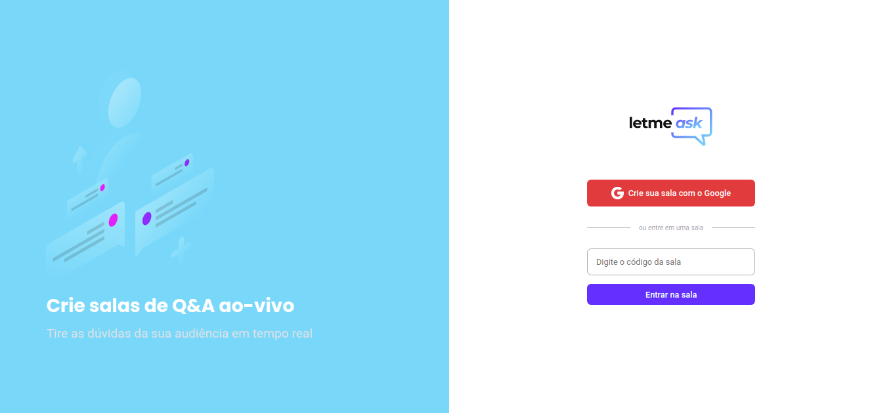
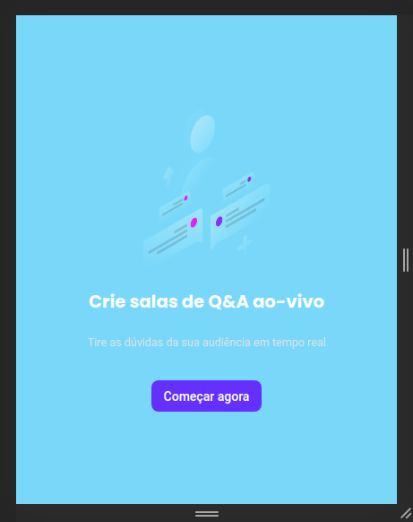
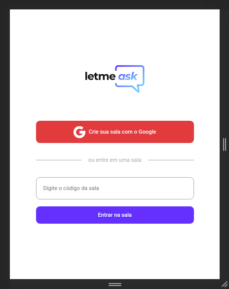
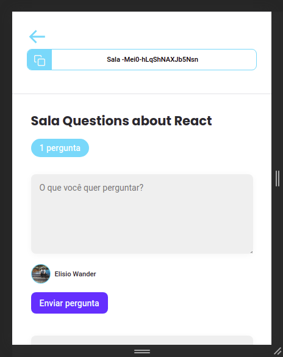
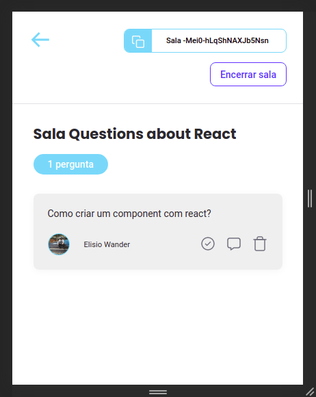
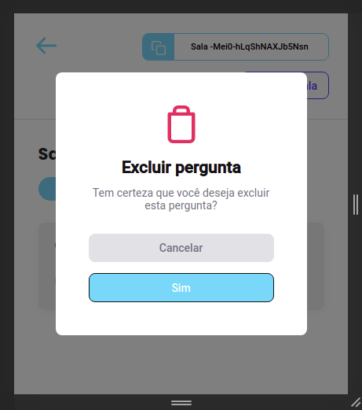

<h1 align="center">
    
</h1>


<h1 align="">
    
    
    
    
    
    
</h1>

## 🏷️ Sobre 
**Letmeask** é uma aplicação desenvolvida para facilitar a comunicação entre criadores de conteúdo e o seu público atravéz de salas de Q&A, uma forma mais organizada e democrática de fazer essa intermediação. O projeto foi desenvolvido durante a sexta edição do evento Next Level Week(**trilha React**), feito pela 🚀[Rocketseat](https://rocketseat.com.br/) e ministrado pelo professor [Diego Fernandes](https://github.com/diego3g).

---

## 🛠️ Tecnologias utilizadas
Foram utilizadas as seguintes tecnologias para desenvolver a aplicação **Letmeask** :

- [React](https://reactjs.org/)
- [Typescript](https://www.typescriptlang.org/)
- [Firebase](https://firebase.google.com/)
- [StyledComponents](https://styled-components.com/)

---

## 🗂️ Como baixar e iniciar o projeto 

```bash

    #clonar o projeto
    $ git clone https://github.com/ElisioWander/-Letmeask-next-level-week-06.git

    #entrar no diretório
    $ cd -Letmeask-next-level-week-06

    #instalar as dependências
    $ yarn

    #iniciar a aplicação
    $ yarn start
```
### Servidor local
localhost:3000

## ⚠️ ALERT ⚠️
Lembrando que será necessário criar uma conta no [Firebase](https://console.firebase.google.com/) e um projeto para disponibilizar um Realtime Database.

---

## 🏷️ Layout 
Você pode visualizar o layout do projeto através do link abaixo:

[layout](https://www.figma.com/file/u0BQK8rCf2KgzcukdRRCWh/Letmeask/duplicate?node-id=0%3A1)

Lembrando que você precisa ter uma conta no [Figma](https://www.figma.com/).

---

## Obs

Afim de melhorar o projeto e desenvolver minhas habilidades como programador, eu tomei a iniciativa de fazer algumas alterações, corrigir pequenos bugs que eu observei, acrescentar algumas funcionalidades e criar a responsividade da aplicação. Algumas das modificações foram:

- Cores do projeto e a organização delas fazendo a utilização de variáveis
- Estilização feita com Styled-Components
- Criação de modais utilizando a biblioteca React-Modal
- Responsividade da aplicação

## Autor
### 👤 Elisio Wander

- Linkedin: [@elisioWander](https://www.linkedin.com/in/elisio-wander-b88b69136/)
- github: [@elisioWander](https://github.com/ElisioWander)

---
## 📝 Licença
Copyright © 2020 [@ElisioWander](https://github.com/ElisioWander/-Letmeask-next-level-week-06/blob/master/LICENSE)

Este projeto está sobe a [LICENÇA MIT](https://opensource.org/licenses/MIT)

---

### Desenvolvido 💜 by Elisio Wander
